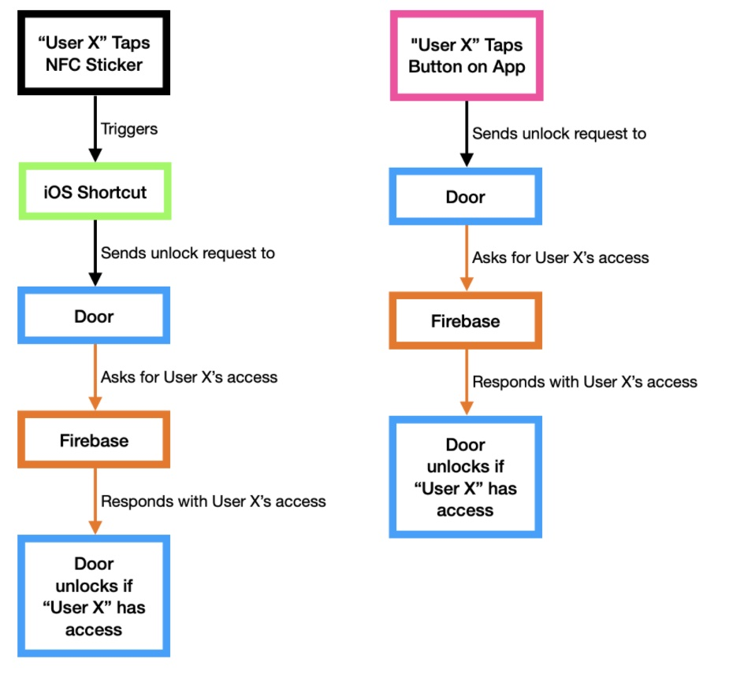
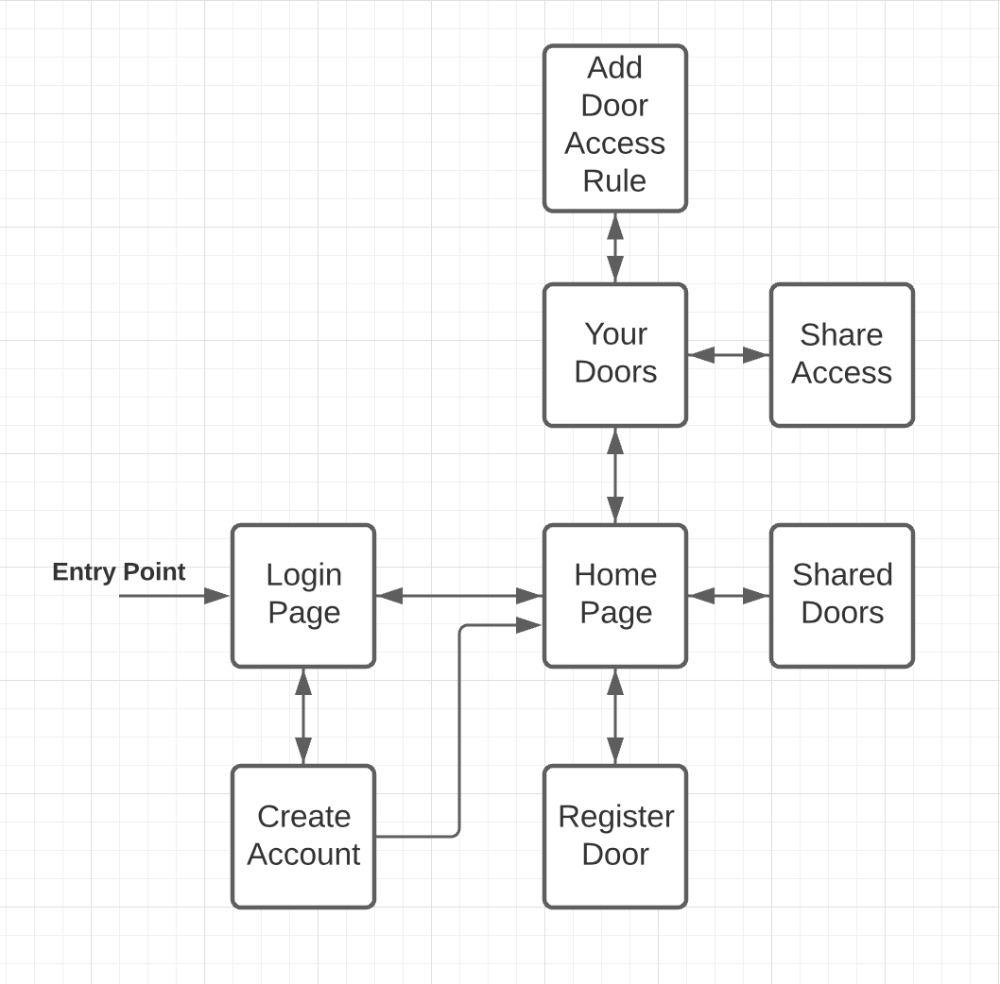

## Overall Architecture Design

Justification

## Database Structure
#### Justification for Firebase rules

Users are the only ones that can read/write to /users/private/{uid} where {uid} is the unique identifier that Firebase Auth has assigned to them
Doors are stored under /door/{doorcode} where {doorcode} is the 10-character alphanumeric string that uniquely identifies each Sentinel device
The list of doors a user has access to is stored under /users/access/{uid}/shared and /users/access/{uid}/owned. The frontend can retrieve that list of doorcodes and then query data about each door from /doors/{doorcode}

Access is shared by writing to /users/access/{uid}/shared, and validation is done by Firebase to ensure that whoever adds a doorcode as a child node at this location is listed under /doors/{doorcode}/owners. This prevents a malicious actor with access to the frontend source code from granting themselves access to every door.
Many other mechanisms are in place to ensure security at every node! The Firebase security rules will be uploaded, but as they are very sensitive (i.e., should never, ever be publicly accessible, in the event that a loophole is discovered or bug exists), we'd like to use a separate repository for them.

#### Justification for Firebase design
Door Activation Table:
This table exists so that a rogue agent cannot claim doors that haven’t been distributed yet. This table is included for future expandability.

Doors Table:
This table is used to track doors that have been registered as well as who has access to them and who owns them.

Usernames Table:
The usernames table is used to track which usernames are linked to which userID’s which are linked to auth accounts.

Users Table:
The users table tracks what access each given user has. This means that we track what doors are owned under each user ID and what doors that user has access to under each user ID.

Private and Public Table:
These two tables are built for expandability. These tables would store information about each user like their username, email, phone number, etc. Any data in the public table would be accessible by search. This would help with the expansion of friends features which we have in our backlog.

Sentinel Database
- door-activation
  - door-id: activation-status
- doors
  - door-id
    - access
      - user-id
        - time-weekly-whitelist
          - access-data
            - access-timeframe
          - access-token
    - owners
      - user-id
        - access-token
- usernames
  - username
    - case-stylized: cs-username
    - owner: user-id
- users
  - access
    - user-id
      - owned
        - door-id
          - access-token: access-token
          - nickname: nickname
      - shared
        - door-id
          - access-tokens
            - time-weekly-whitelist: access-token
          - nickname: nickname
- private
  - user-id
    - username: username
- public
  - user-id
    - username: username

## Front-End User Flow Diagram

